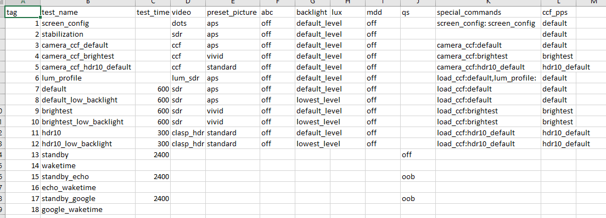
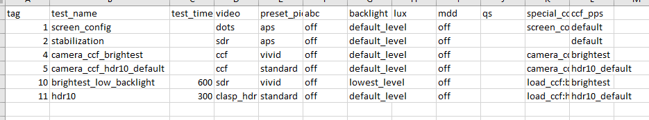

# TV Test System Scripts

These scripts are designed to be used with the TV Test System desktop application (see Installation).
They are responsible for generating correct input files for TV testing and providing automated data analysis of TV testing results.
Each script implements a CLI (outlined below), but for the most part the desktop application will be responsible for interfacing with the scripts.

# Installation
First you should download Labview, then download test scripts and place in correct location (see below)... 
scripts should be called correctly by labview but can also be run by user from command line...
## TV Test System Installation

## Scripts Installation
1. go to https://github.com/pacific-crest-labs/cmdTestSequence/releases
2. Click on (download) tv_test_scripts.zip from the most recent release. 
3. The directory containing the TV Test System application has an empty subdirectory called "External Scripts".
Extract the zip file into the empty External Scripts directory. 

    - Note: After extracting don't separate any of the .exe files from the surrounding file structure or these scripts may not work.

The resulting file structure should look like this or close to it:

    TV Test Sytstem
    │   Error_User_Guide.html
    │   niimaqdx.dll
    │   NIVision.dll
    │   NIVisSvc.dll
    │   TV Test System.aliases
    │   TV Test System.exe
    │   TV Test System.ini
    │
    └───External Scripts
        │   api-ms-win-crt-heap-l1-1-0.dll
        │   api-ms-win-crt-locale-l1-1-0.dll
        │   api-ms-win-crt-math-l1-1-0.dll
        │   api-ms-win-crt-runtime-l1-1-0.dll
        │   api-ms-win-crt-stdio-l1-1-0.dll
        │   apl_power_charts.exe
        │   basic_report.exe
        │   ccf.exe
        │   compliance_report.exe
        │   lum_report.exe
        │   main_sequence.exe
        │   manual_sequence.exe
        │   overlay.exe
        │   pcl_sequence.exe
        │   python36.dll
        │   repair_sequence.exe
        │   report.exe
        │
        ├───config
        │   │   coeffs.csv
        │   │   entry-forms.xlsx
        │   │   intro-text.csv
        │   │   manual-sequence.csv
        │   │   power-cap-coeffs.csv
        │   │   test-details.csv
        │   │
        │   └───apl
        ├───img
        └───lib
    
# FS

    All TV Tests
    ├───TV Model 1
    │   ├───Test Mode 1
    │   │   │   test data file 1
    │   │   │   test data file 2
    │   │   │   test data file 3
    │   ├───Test Mode 2
    │   └───Test Mode 3
    ├───TV Model 2
    └───TV Model 3
    
f

    All TV Tests
    ├───LG_49UM7300
    │   ├───ENERGYSTAR
    │   │   │   test-sequence.csv
    │   │   │   command-sequence.csv
    │   │   │   report.pdf
    │   │   │   ...
    │   ├───Alternative
    │   │   │   test-sequence.csv
    │   │   │   command-sequence.csv
    │   │   │   report.pdf
    │   │   │   ...
    │   └───Manual
    ├───Samsung_QN75Q70R
    └───Vizio_M437

# Test Sequence Generation Scripts
These scripts use information about the TV and the desired tests to generate the correct sequence of tests
and prepare the corresponding input files for the desktop application.

## main_sequence.exe

    Usage:
    main_sequence.exe  <data_folder> <default_pps> <brightest_pps> [options]
    
    Arguments:
      data_folder       directory where data for this test sequence will be stored
      default_pps       name of default preset picture setting
      brightest_pps     name of brightest preset picture setting
    
    Options:
      -h --help
      --defabc      include abc on tests for default pps
      --hdr=pps     specify hdr preset picture setting for testing
      --hdrabc      include abc on tests for hdr pps
      --brabc       include abc on tests for brightest pps
      --qs=secs     tv has quickstart off by default, number of seconds to wake with quickstart off
      
### main_sequence.exe Output Files

1. Test Sequence (test-sequence.csv) - a csv file where each line is a test and each column is a test detail (feature)

2. Command Sequence (command-sequence.csv) - the sequence of commands to be read by the desktop application in order to execute the test sequence.   

Two copies of each output file are made. One is dropped in the app's AppData directory ("C:\Users\user\AppData\Local\DMC\TV Luminance Test System") 
while the other is dropped into the data_folder. If the data_folder does not already exist, then it is created.
The app's AppData directory is where the desktop application searches for command-sequence.csv in order to run a test.
When a new test sequence is run the test sequence files in the AppData directory will be overwritten with data for the new test sequence.

#### main_sequence.exe Simplest Example:

    main_sequence.exe "C:\Users\UserName\TVTests\SomeModel\TestMode" standard vivid

This would construct a test sequence without abc or hdr tests.
The data_folder is "C:\Users\UserName\TVTests\SomeModel\TestMode" (relative path is fine too).
The default pps is standard. The brightest pps is vivid.

#### main_sequence.exe QS Examples:

    main_sequence.exe "C:\Users\UserName\TVTests\SomeModel\TestMode" standard vivid --qs=8

If the TV has a quickstart feature and defaults to quickstart off, use --qs flag followed by the number of seconds it takes this tv to wake from sleep in its default mode.
If the the tv doesn't have quickstart or has quickstart and defaults to quickstart on, omit this flag

#### main_sequence.exe ABC Examples:

    main_sequence.exe "C:\Users\UserName\TVTests\SomeModel\TestMode" standard vivid --defabc
    main_sequence.exe "C:\Users\UserName\TVTests\SomeModel\TestMode" standard vivid --defabc --brabc

Use --defabc to include abc on tests for the default pps and --brabc to include abc on tests for the brightest pps.

#### HDR Examples:

    main_sequence.exe "C:\Users\UserName\TVTests\SomeModel\TestMode" standard vivid --hdr=standard
    main_sequence.exe "C:\Users\UserName\TVTests\SomeModel\TestMode" standard vivid --hdr=standard --hdrabc

To include HDR testing use --hdr followed by default hdr pps.
To include HDR testing with abc on use --hdr followed by default hdr pps and --hdrabc.
Using --hdrabc without --hdr=pps will be ignored.

#### main_sequence.exe Everything Example:

    main_sequence.exe "C:\Users\UserName\TVTests\LG_49UM7300\Alternative" aps vivid --defabc --brabc --hdr=standard --qs=8
  
Argument Breakdown:
 - ("C:\Users\UserName\TVTests\LG_49UM7300\Alternative") our data will be saved here
    - our tv model is LG_49UM730
    - the test mode (test sequence name) is Alternative
 - (aps) its default preset picture setting is aps
 - (vivid) its brightest pps is vivid
 - (--defabc) test the default pps (aps) with abc on
 - (--brabc) test the brightest pps (vivid) with abc on
 - (--hdr=standard) test with hdr content, default hdr pps is standard
 - (--qs=8) tv has quickstart and defaults to quickstart off, time to wake with quickstart off is 8 seconds
 
## partial_sequence.exe

    Usage:
    partial_sequence.exe  <data_folder> <tags>... [options]
    
    Arguments:
      data_folder       folder with test data
      tags              list of tests to include in partial sequence
      
    Options:
      -h --help

After main_sequence.exe has successfully been executed and their is a test-sequence.csv file in the data_folder,
partial_sequence.exe can be used to queue up a partial run of the test sequence.
Reasons for executing a partial run include redoing faulty tests as well as a general desire to not run every test generated by main_sequence.exe.  

The partial test sequence generated will include the following tests/steps:  
- screen_config
- stabilization tests
- color correction factor tests if they have not already been done (if no ccf-output.csv is present in data_folder)
- tests specified (by tag number) in command line arguments 

#### partial_sequence.exe Example

    partial_sequence.exe "C:\Users\UserName\TVTests\LG_49UM7300\ENERGYSTAR" 10 11
    
If the file pictured below is our original test-sequence.csv within the folder "C:\Users\UserName\TVTests\LG_49UM7300\Alternative",
then by passing in arguments 10 and 11 we are queueing up a partial sequence that will run the test at tag 10 (brightest_low_backlight), 
the test at tag 11 (hdr10), as well as color correction factor steps (if necessary) and stabilization tests.

The resulting partial test sequence will look something like this:

#### partial_sequence.exe Output Files
# todo: include overview of what happens after partial test sequence as been completed
- TV Test System app will drop datalog into data_folder like any other test and report script will handle stitching tests into merged

The output files of partial_sequence.exe are the same as the output files of main_sequence.exe, test-sequence.csv and command-sequence.csv.
Two copies of each output file are made. One is dropped in the app's AppData directory ("C:\Users\user\AppData\Local\DMC\TV Luminance Test System") 
while the other is dropped into a subdirectory of data_folder named Partial. This subdirectory will be created if it doesn't already exist.
The copies dropped in the Partial subdirectory will be renamed to include the date and time of creation
in the format of year, month, day, hour, minute (e.g. test-sequence-2020-Oct-25-10-48.csv).
Files in the Partial subdirectory are only included for records and manual debugging. They're not used at any later point or by any other script.

# Color Correction Factor Script
This script calculates correction factors which Labview then applies to its luminance readings.
It does this by comparing the test camera's luminance readings on still images to luminance readings from a reference photometer.  
There is a correction factor (linear transformation) calculated for each preset picture setting.

# Report Scripts
The report scripts take the results of TV testing and generate pdf reports.
They are meant to be called after TV testing has been completed.