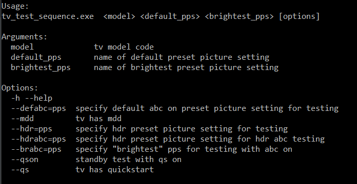
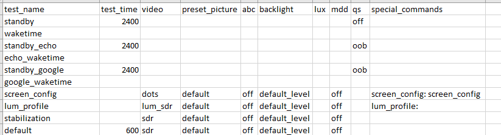

# Title
# Usage

Simplest Example:

    tv_test_sequence.exe some_model standard vivid

This would be for a television without abc, mdd, qs, or hdr.
The model name is some_model. The default pps is standard. The brightest pps is vivid

MDD Example:  
    tv_test_sequence.exe some_model standard vivid --mdd  

QS Examples:

    tv_test_sequence.exe some_model standard vivid --qs
    tv_test_sequence.exe some_model standard vivid --qs --qson

If the TV has quickstart, use --qs.
If the the tv needs to be standby tested with quickstart on, use both --qs and --qson.
Using --qs without --qson will default to standby testing with quickstart off.
Using --qson without --qs will be ignored.

ABC Examples:

    tv_test_sequence.exe some_model standard vivid --defabc standard --brabc  vivid
    tv_test_sequence.exe some_model standard vivid --defabc standard

To test with abc on include --defabc followed by the default pps and --brabc followed by the brightest_pps.
In most cases this will be the same pps specified in the <default_pps> and <brightest_pps> arguments
but some TVs only allow ABC functionality in certain pps.
Using --defabc without --brabc or vice versa is allowed. Test sequence will then only include abc on tests for specified pps.

HDR Examples:

    tv_test_sequence.exe some_model standard vivid --hdr standard
    tv_test_sequence.exe some_model standard vivid --hdr standard --hdrabc standard

To include HDR testing use --hdr followed by default hdr pps.
To include HDR testing with abc on use both  --hdr followed by default hdr pps and --hdrabc followed by default hdr pps.
Using -hdrabc without --hdr will be ignored.

Everything Example:

    tv_test_sequence.exe LG_49UM7300 aps vivid --defabc aps --brabc vivid --hdr standard --mdd --qs --qson
  
Argument Breakdown:
 - (LG_49UM7300) our tv model is LG_49UM7300
 - (aps) its default preset picture setting is aps
 - (vivid) its brightest pps is vivid
 - (--defabc aps) test with abc on in its default abc on pps, aps
 - (--brabc vivid) test with abc on in its brightest pps, vivid
 - (--hdr standard) test with hdr content in default hdr pps, standard
 - (--mdd) tv has motion detection dimming
 - (--qs) tv has quickstart
 - (--qson) test tv with quickstart on (for standby tests)
 
# Output Files
1. Test Sequence - a csv file where each line is a test and each column is a test detail

2. Command Sequence - the sequence of commands to be read by LabView in order to execute the test sequence  

