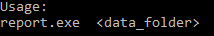

# TV Test Report Generator CLI
# Installation
# Usage
  

The only argument needed is the data folder containing the tv test files.
This directory must contain all the necessary files for a single report (see below).

#### Example

relative path:

    report.exe LG_60UM6900
   
absolute path:

    report.exe C:\LabTests\LG_60UM6900

# Necessary TV Test Files
These files need to be contained within the data folder and they must contain the relevant keyword within their file
name in order for the script to correctly identify them.
- Test Metadata
    - keyword: metadata
    - description: a two column csv containing test metadata (tester name, lab name...) as well as tv specifications.
    This file is generated by LabVIEW after user inputs data on the first screen.
- Test Sequence
    - keyword: test-sequence
    - description: a csv file where each line is a test and each column is a test detail.
    This file is an output file of the TV Test Sequence Generator.
- Luminance Profile
    - keyword: lum
    - description: a csv file with results from the luminance profile test.
    Rows represent spacing along y axis of TV, columns represent spacing along x axis, values are nits.
    This file is generated by LabVIEW after testing is complete.
- Power and Luminance Data
    - keyword: TBD
    - description: a csv file showing the power and luminance readings at each second during testing.
    This file is generated by LabVIEW after testing is complete.

# Output Files
These files will be saved within the data folder.
- Merged Data
    - file name: Merged.csv
    - description: the result of SQL like joins of power/luminance data, test sequence, and APL test clip data. 
- Results Summary - a csv file with
    - file name: results-summary.csv
    - description: a csv showing the TV's average power and luminance during each test as well as test details. 
- Report
    - file name: report.pdf
    - description: the pdf report with custom tables and plots of testing results.

# Configuration Files
These files/folders are in the same directory as the executable.
- coeffs.csv - values for the coefficients of the power limit functions used in the pdf report.
- intro-text.csv - A file to add and alter the text that appears at the beginning of the sections in the pdf report.
- APL folder - folder containing csv files containing each test clip's average picture level (video signal) information. 