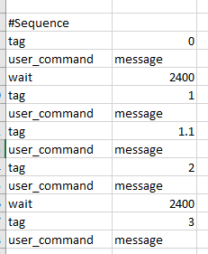

# TV Test Sequence Generator CLI
# Installation

Don't move the tv_test_sequence.exe file out of its folder. It will not work.

# Usage
  
#### Simplest Example:

    tv_test_sequence.exe some_model standard vivid

This would construct a test sequence without abc tests, .
The model name is some_model. The default pps is standard. The brightest pps is vivid

#### QS Examples:

    tv_test_sequence.exe some_model standard vivid --qs=8

If the TV has a quickstart feature and defaults to quickstart off, use --qs flag followed by the number of seconds it takes this tv to wake from sleep in its default mode.
If the the tv doesn't have quickstart or has quickstart and defaults to quickstart on, omit this flag

#### ABC Examples:

    tv_test_sequence.exe some_model standard vivid --defabc
    tv_test_sequence.exe some_model standard vivid --defabc --brabc

Use --defabc to include abc on tests for the default pps and --brabc to include abc on tests for the brightest pps.

#### HDR Examples:

    tv_test_sequence.exe some_model standard vivid --hdr=standard
    tv_test_sequence.exe some_model standard vivid --hdr=standard --hdrabc

To include HDR testing use --hdr followed by default hdr pps.
To include HDR testing with abc on use --hdr followed by default hdr pps and --hdrabc.
Using --hdrabc without --hdr=pps will be ignored.

#### Everything Example:

    tv_test_sequence.exe LG_49UM7300 aps vivid --defabc --brabc --hdr=standard --qs=8
  
Argument Breakdown:
 - (LG_49UM7300) our tv model is LG_49UM7300
 - (aps) its default preset picture setting is aps
 - (vivid) its brightest pps is vivid
 - (--defabc) test the default pps (aps) with abc on
 - (--brabc) test the brightest pps (vivid) with abc on
 - (--hdr=standard) test with hdr content, default hdr pps is standard
 - (--qs=8) tv has quickstart and defaults to quickstart off, time to wake is 8 seconds
 
# Output Files
1. Test Sequence - a csv file where each line is a test and each column is a test detail (feature)

2. Command Sequence - the sequence of commands to be read by LabView in order to execute the test sequence  

# Configuration Files
These files/folders are in the same directory as the executable.
- test-details.csv - contains all the test details for all of the possible tests.